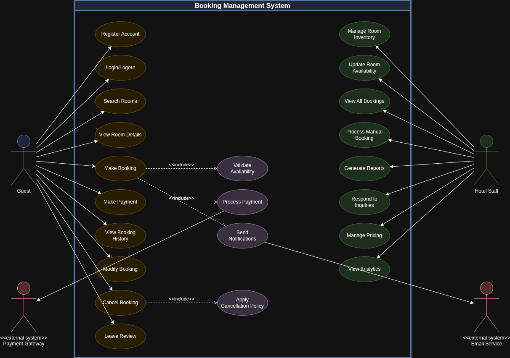

# README.md

## Introduction

This repository documents the complete requirement analysis process for a booking management system, serving as a practical guide for developers to master this critical SDLC phase.

This project demonstrates how to transform project needs into structured, professional documentation that forms the foundation for successful software development. It covers requirement gathering, documentation, visual modeling with Draw.io, and defining clear acceptance criteria.

## What is Requirement Analysis?

Requirement Analysis is a critical phase in the Software Development Lifecycle (SDLC) that involves systematically identifying, documenting, validating, and managing the needs and expectations of stakeholders for a software system. It serves as the bridge between business objectives and technical implementation, transforming abstract ideas and business needs into concrete, actionable specifications that guide the entire development process.

Requirement Analysis typically occurs after the initial project conception and before the design phase. It acts as the foundation upon which all subsequent development activities are built. During this phase, teams work closely with stakeholders—including clients, end-users, business analysts, and technical teams—to gather comprehensive information about what the system should accomplish, how it should perform, and what constraints it must operate within.

Key Activities in Requirement Analysis
1. Requirement Gathering
Collecting information from stakeholders through interviews, surveys, workshops, observation, and document analysis to understand their needs, expectations, and pain points.
2. Requirement Documentation
Recording requirements in a clear, structured format using specifications documents, user stories, or requirement management tools to ensure all stakeholders have a shared understanding.
3. Requirement Analysis and Modeling
Examining gathered requirements to identify patterns, relationships, and potential conflicts. Creating visual models such as use case diagrams, data flow diagrams, and process models to represent system behavior.
4. Requirement Validation
Verifying that documented requirements accurately reflect stakeholder needs, are feasible to implement, and align with business objectives through reviews, prototypes, and stakeholder approval.
5. Requirement Management
Tracking changes to requirements throughout the project lifecycle, managing requirement priorities, and ensuring traceability from initial specifications to final implementation.

### Importance in the Software Development Lifecycle

1. Prevents Costly Errors
Identifying and resolving requirement issues early in the SDLC is significantly less expensive than fixing problems discovered during later phases. Studies show that fixing a defect found during requirements costs 10-100 times less than fixing the same defect during maintenance.
2. Aligns Stakeholder Expectations
Clear requirement documentation ensures that developers, clients, project managers, and end-users all share the same vision for the final product, reducing misunderstandings and conflicts.
3. Provides Project Foundation
Requirements serve as the baseline for all project planning activities, including effort estimation, resource allocation, timeline development, and budget forecasting.
4. Enables Effective Design and Development
Well-defined requirements give developers and designers clear guidance on what to build, allowing them to make informed technical decisions and create appropriate system architectures.
5. Facilitates Testing and Validation
Detailed requirements provide the basis for creating test cases and acceptance criteria, enabling quality assurance teams to verify that the system meets specified needs.
6. Reduces Scope Creep
Documented requirements establish clear project boundaries, making it easier to identify and manage scope changes through formal change control processes.
7. Improves Project Success Rates
Projects with thorough requirement analysis have significantly higher success rates. According to industry research, incomplete requirements are one of the top causes of project failure.

## Why is Requirement Analysis Important?

Requirement Analysis is a cornerstone of successful software development, directly impacting project outcomes, team efficiency, and stakeholder satisfaction. Below are the key reasons why this phase is critical in the SDLC:
1. Reduces Development Costs and Time
Requirement Analysis significantly minimizes financial and time investments by identifying issues before development begins. When requirements are poorly defined or misunderstood, development teams build features that don't meet user needs, leading to extensive rework. Research indicates that fixing a defect during the requirement phase costs approximately $100, while the same defect discovered during maintenance can cost $10,000 or more.

Key Benefits:

Early detection of conflicting or infeasible requirements prevents wasted development effort
Clear specifications reduce back-and-forth clarifications during coding
Accurate requirements enable better project estimation, preventing budget overruns
Teams can identify and eliminate unnecessary features before investing resources in building them

Real-World Impact: A booking management system developed without proper requirement analysis might build a complex multi-currency payment system, only to discover later that the business operates in a single region and needs only one currency. This costly mistake could have been avoided with thorough upfront analysis.
2. Ensures Stakeholder Alignment and Satisfaction
Requirement Analysis creates a shared understanding among all project participants—clients, end-users, developers, designers, and project managers. This alignment is crucial because different stakeholders often have different perspectives, priorities, and expectations for the system.
Key Benefits:

Establishes a single source of truth that all parties reference throughout development
Surfaces conflicting expectations early when they're easier to resolve
Provides a clear basis for decision-making when trade-offs are necessary
Creates measurable acceptance criteria that define project success objectively
Builds stakeholder confidence by demonstrating thorough understanding of their needs

Real-World Impact: In a booking management system, hotel managers might prioritize revenue optimization features, while front-desk staff need quick, simple booking interfaces, and guests want mobile-friendly self-service options. Requirement Analysis identifies these diverse needs and creates a solution that balances all stakeholder interests, preventing dissatisfaction after launch.
3. Provides a Solid Foundation for Design, Development, and Testing
Well-documented requirements serve as the blueprint for all downstream activities in the SDLC. They guide architects in designing system structure, developers in writing code, and quality assurance teams in creating test cases. Without this foundation, teams work on assumptions that may not align with actual needs.
Key Benefits:

For Designers: Requirements inform user interface design, user experience flows, and system architecture decisions
For Developers: Clear specifications reduce ambiguity, enabling developers to write code confidently without constant clarification requests
For Testers: Requirements provide the basis for creating comprehensive test cases and defining expected system behavior
For Project Managers: Requirements enable accurate task breakdown, resource allocation, and progress tracking
For Maintenance Teams: Well-documented requirements help future developers understand the system's intended behavior when fixing bugs or adding features

Real-World Impact: A booking management system's requirement stating "Users must be able to cancel bookings up to 24 hours before check-in" gives designers clear guidance on UI elements needed, developers specific business logic to implement, and testers exact scenarios to verify. Without this clarity, each team member might interpret the cancellation policy differently, resulting in an inconsistent, buggy feature.
4. Minimizes Scope Creep and Project Risks
Requirement Analysis establishes clear project boundaries by documenting what is included and, equally importantly, what is excluded from the project scope. This documentation becomes a powerful tool for managing scope changes and preventing "feature creep" that derails timelines and budgets.
Key Benefits:

Provides objective criteria for evaluating proposed changes
Creates a formal change control process based on documented requirements
Helps stakeholders understand the impact of new requests on timeline and budget
Identifies potential risks and dependencies early in the project lifecycle
Enables proactive risk mitigation planning before issues arise

Real-World Impact: When a stakeholder requests adding a "loyalty rewards program" to a booking system mid-development, documented requirements allow the team to assess this as a scope change, evaluate its impact, and make informed decisions about whether to include it in the current release or defer to a future phase.
5. Improves Communication Across Technical and Non-Technical Teams
Requirement Analysis bridges the gap between business stakeholders who understand the problem domain and technical teams who build the solution. It translates business needs into technical specifications and vice versa, ensuring effective communication throughout the project.

Key Benefits:

Uses clear, jargon-free language that both business and technical stakeholders understand
Creates visual models (diagrams, mockups, prototypes) that transcend language barriers
Establishes a common vocabulary for discussing system features and behaviors
Reduces misunderstandings that lead to building the wrong solution
Facilitates more productive meetings and discussions with shared reference points

README.md
Introduction
This repository documents the complete requirement analysis process for a booking management system, serving as a practical guide for developers to master this critical SDLC phase.
This project demonstrates how to transform project needs into structured, professional documentation that forms the foundation for successful software development. It covers requirement gathering, documentation, visual modeling with Draw.io, and defining clear acceptance criteria.
What is Requirement Analysis?
Requirement Analysis is a critical phase in the Software Development Lifecycle (SDLC) that involves systematically identifying, documenting, validating, and managing the needs and expectations of stakeholders for a software system. It serves as the bridge between business objectives and technical implementation, transforming abstract ideas and business needs into concrete, actionable specifications that guide the entire development process.
Requirement Analysis typically occurs after the initial project conception and before the design phase. It acts as the foundation upon which all subsequent development activities are built. During this phase, teams work closely with stakeholders—including clients, end-users, business analysts, and technical teams—to gather comprehensive information about what the system should accomplish, how it should perform, and what constraints it must operate within.
Why is Requirement Analysis Important?
Requirement Analysis is a cornerstone of successful software development, directly impacting project outcomes, team efficiency, and stakeholder satisfaction. Below are the key reasons why this phase is critical in the SDLC:
1. Reduces Development Costs and Time
Requirement Analysis significantly minimizes financial and time investments by identifying issues before development begins. When requirements are poorly defined or misunderstood, development teams build features that don't meet user needs, leading to extensive rework. Research indicates that fixing a defect during the requirement phase costs approximately $100, while the same defect discovered during maintenance can cost $10,000 or more.
Key Benefits:

Early detection of conflicting or infeasible requirements prevents wasted development effort
Clear specifications reduce back-and-forth clarifications during coding
Accurate requirements enable better project estimation, preventing budget overruns
Teams can identify and eliminate unnecessary features before investing resources in building them

2. Ensures Stakeholder Alignment and Satisfaction
Requirement Analysis creates a shared understanding among all project participants—clients, end-users, developers, designers, and project managers. This alignment is crucial because different stakeholders often have different perspectives, priorities, and expectations for the system.
Key Benefits:

Establishes a single source of truth that all parties reference throughout development
Surfaces conflicting expectations early when they're easier to resolve
Provides a clear basis for decision-making when trade-offs are necessary
Creates measurable acceptance criteria that define project success objectively
Builds stakeholder confidence by demonstrating thorough understanding of their needs

3. Provides a Solid Foundation for Design, Development, and Testing
Well-documented requirements serve as the blueprint for all downstream activities in the SDLC. They guide architects in designing system structure, developers in writing code, and quality assurance teams in creating test cases. Without this foundation, teams work on assumptions that may not align with actual needs.
Key Benefits:

For Designers: Requirements inform user interface design, user experience flows, and system architecture decisions
For Developers: Clear specifications reduce ambiguity, enabling developers to write code confidently without constant clarification requests
For Testers: Requirements provide the basis for creating comprehensive test cases and defining expected system behavior
For Project Managers: Requirements enable accurate task breakdown, resource allocation, and progress tracking
For Maintenance Teams: Well-documented requirements help future developers understand the system's intended behavior when fixing bugs or adding features

4. Minimizes Scope Creep and Project Risks
Requirement Analysis establishes clear project boundaries by documenting what is included and, equally importantly, what is excluded from the project scope. This documentation becomes a powerful tool for managing scope changes and preventing "feature creep" that derails timelines and budgets.
Key Benefits:

Provides objective criteria for evaluating proposed changes
Creates a formal change control process based on documented requirements
Helps stakeholders understand the impact of new requests on timeline and budget
Identifies potential risks and dependencies early in the project lifecycle
Enables proactive risk mitigation planning before issues arise

5. Improves Communication Across Technical and Non-Technical Teams
Requirement Analysis bridges the gap between business stakeholders who understand the problem domain and technical teams who build the solution. It translates business needs into technical specifications and vice versa, ensuring effective communication throughout the project.
Key Benefits:

Uses clear, jargon-free language that both business and technical stakeholders understand
Creates visual models (diagrams, mockups, prototypes) that transcend language barriers
Establishes a common vocabulary for discussing system features and behaviors
Reduces misunderstandings that lead to building the wrong solution
Facilitates more productive meetings and discussions with shared reference points

## Key Activities in Requirement Analysis

Requirement Analysis is a structured process consisting of five essential activities that work together to transform stakeholder needs into clear, actionable specifications. Each activity plays a crucial role in ensuring the final software system meets its intended goals.
1. Requirement Gathering
Requirement Gathering is the initial phase where information is collected from various sources to understand what the system needs to accomplish.

Identify Stakeholders: Determine all individuals and groups who have an interest in or will be affected by the system (end-users, clients, managers, technical teams, regulatory bodies)
Conduct Stakeholder Interviews: Hold one-on-one or group discussions with stakeholders to understand their needs, pain points, and expectations
Distribute Surveys and Questionnaires: Collect information from a larger audience through structured forms to gather quantitative and qualitative data
Facilitate Workshops and Brainstorming Sessions: Organize collaborative meetings where stakeholders can discuss requirements, resolve conflicts, and reach consensus
Perform Document Analysis: Review existing documentation such as business plans, current system manuals, process documents, and competitor analysis
Conduct Observation and Job Shadowing: Watch users perform their current tasks to understand workflows, challenges, and unstated needs
Analyze Existing Systems: Study current systems (if any) to identify what works well, what needs improvement, and what should be retained

2. Requirement Elicitation
Requirement Elicitation goes deeper than gathering, using specific techniques to draw out hidden, implicit, or未articulated needs that stakeholders may not explicitly state.

Use Prototyping: Create mockups, wireframes, or working prototypes to help stakeholders visualize the system and provide concrete feedback
Apply Use Case Scenarios: Develop detailed scenarios showing how different users will interact with the system to accomplish specific goals
Conduct Focus Groups: Organize structured discussions with selected user groups to explore specific topics in depth and uncover collective insights
Employ Brainstorming Techniques: Use creative techniques like mind mapping, affinity diagrams, or the "5 Whys" to uncover root causes and innovative solutions
Perform Task Analysis: Break down complex tasks into smaller steps to understand detailed requirements for each activity
Create User Stories: Write brief, user-focused descriptions of functionality (e.g., "As a hotel guest, I want to view room photos so that I can choose the best room for my needs")
Identify Edge Cases and Exceptions: Explore unusual scenarios, error conditions, and boundary cases that might not be immediately obvious
Analyze Constraints: Identify technical, business, legal, and resource constraints that will impact the solution

3. Requirement Documentation
Requirement Documentation involves recording all gathered and elicited requirements in a clear, structured, and accessible format that serves as a reference throughout the project lifecycle.

Create a Requirements Specification Document (SRS): Develop a comprehensive document that formally describes all functional and non-functional requirements
Write Clear and Concise Requirements: Use precise language that is unambiguous, testable, and understandable by both technical and non-technical stakeholders
Organize Requirements Logically: Structure requirements into categories (functional, non-functional, system, user) with clear hierarchies and relationships
Assign Unique Identifiers: Give each requirement a unique ID for traceability and reference (e.g., REQ-001, FUNC-042)
Include Requirement Attributes: Document priority (high/medium/low), source, rationale, dependencies, and acceptance criteria for each requirement
Use Standard Templates: Employ industry-standard formats and templates to ensure consistency and completeness
Document Assumptions and Constraints: Record any assumptions made and constraints identified that affect the requirements
Maintain Version Control: Track changes to requirements over time with version numbers, change logs, and approval dates

4. Requirement Analysis and Modeling
Requirement Analysis and Modeling involves examining documented requirements to ensure they are complete, consistent, feasible, and properly understood, often using visual models to represent system behavior.

Identify Conflicts and Inconsistencies: Review requirements to find contradictions, overlaps, or gaps that need resolution
Assess Feasibility: Evaluate whether requirements can be implemented within technical, budgetary, and time constraints
Prioritize Requirements: Rank requirements based on business value, risk, dependencies, and stakeholder importance using techniques like MoSCoW (Must have, Should have, Could have, Won't have)
Analyze Dependencies: Identify relationships between requirements to understand implementation order and potential impacts
Create Use Case Diagrams: Develop visual representations showing actors (users) and their interactions with the system
Develop Data Flow Diagrams (DFD): Illustrate how data moves through the system, showing inputs, outputs, processes, and data stores
Build Entity-Relationship Diagrams (ERD): Model the data structure, showing entities, attributes, and relationships
Design Process Models: Create flowcharts or activity diagrams showing business processes and system workflows
Perform Risk Analysis: Identify potential risks associated with requirements and develop mitigation strategies

5. Requirement Validation
Requirement Validation ensures that the documented requirements accurately reflect stakeholder needs, are technically feasible, and will lead to a system that solves the intended problem.

Conduct Requirements Reviews: Organize formal review meetings where stakeholders examine requirements for accuracy, completeness, and clarity
Perform Walkthroughs: Guide stakeholders through requirements step-by-step to ensure understanding and gather feedback
Create Validation Checklists: Use structured checklists to verify that requirements meet quality criteria (clear, testable, feasible, necessary, unambiguous)
Develop Prototypes for Validation: Build low-fidelity or high-fidelity prototypes to validate user interface and workflow requirements
Test Against Acceptance Criteria: Verify that each requirement has clear, measurable acceptance criteria that can be tested
Verify Traceability: Ensure each requirement can be traced back to a business need and forward to design, code, and test cases
Obtain Formal Approval: Secure sign-off from key stakeholders confirming that requirements accurately represent their needs
Check for Completeness: Verify that all necessary requirements have been captured and no critical functionality is missing
Validate Compliance: Ensure requirements meet relevant standards, regulations, and organizational policies

## Types of Requirements

Requirements in software development are typically categorized into two main types: Functional Requirements and Non-functional Requirements. Understanding the distinction between these categories is essential for creating comprehensive system specifications that address both what the system should do and how well it should perform.

1. Functional Requirements
Functional Requirements define the specific behaviors, features, functions, and capabilities that a system must provide. They describe what the system should do in terms of tasks, services, and functions that users can perform. These requirements focus on the system's functionality and the interactions between the system and its users or other systems. Functional requirements are typically expressed as "The system shall..." statements and should be testable and measurable.
Characteristics:

Describe specific system behaviors and functions
Define user interactions and system responses
Specify business rules and logic
Detail input/output requirements
Are directly observable and testable
Focus on "what" the system does

Examples for Booking Management System:

User Registration and Authentication

The system shall allow new users to create an account using email address, password, and basic profile information
The system shall authenticate users through email and password credentials before granting access to booking features
The system shall provide a "Forgot Password" feature that sends password reset links to registered email addresses
The system shall support social media login options (Google, Facebook) as alternative authentication methods

Search and Browse Functionality

The system shall allow users to search for available rooms by check-in date, check-out date, location, and number of guests
The system shall display search results with room photos, descriptions, amenities, pricing, and availability status
The system shall provide filtering options for price range, room type, star rating, and guest reviews
The system shall allow users to sort search results by price (low to high, high to low), popularity, and guest ratings

Booking Management

The system shall enable users to select a room and proceed to booking by entering guest details and payment information
The system shall validate room availability in real-time before confirming a booking
The system shall generate a unique booking confirmation number for each successful reservation
The system shall send booking confirmation emails to users containing reservation details, check-in instructions, and cancellation policy
The system shall allow users to view their booking history and upcoming reservations in their account dashboard
The system shall enable users to modify booking dates (subject to availability) up to 48 hours before check-in
The system shall allow users to cancel bookings according to the cancellation policy and process refunds automatically

Payment Processing

The system shall accept multiple payment methods including credit cards, debit cards, and digital wallets (PayPal, Apple Pay)
The system shall securely process payment transactions through an integrated payment gateway
The system shall validate payment information and display appropriate error messages for declined transactions
The system shall generate and store payment receipts for all successful transactions
The system shall support partial payments and deposit options for advance bookings

Admin Management Functions

The system shall provide an admin dashboard for hotel staff to manage room inventory, pricing, and availability
The system shall allow administrators to add, edit, or remove room listings with photos, descriptions, and amenities
The system shall enable staff to view all bookings with filtering options by date, status, and guest information
The system shall provide reporting features showing booking statistics, revenue analytics, and occupancy rates
The system shall allow administrators to manually create or modify bookings on behalf of guests

Notifications and Communication

The system shall send automated email notifications for booking confirmations, modifications, and cancellations
The system shall send reminder emails to guests 24 hours before their check-in date
The system shall provide in-app notifications for booking status updates and special offers
The system shall enable direct messaging between guests and hotel staff for inquiries and special requests

2. Non-functional Requirements
Non-functional Requirements (NFRs) specify the quality attributes, system properties, and constraints that define how the system should perform its functions. Rather than describing what the system does, NFRs describe how well the system should do it. These requirements address aspects such as performance, security, usability, reliability, scalability, and maintainability. Non-functional requirements are critical for ensuring the system meets user expectations for quality and provides a satisfactory user experience.
Characteristics:

Define quality attributes and system properties
Specify performance and operational criteria
Establish constraints and standards
Address system-wide concerns
May be harder to test than functional requirements
Focus on "how well" the system performs

Examples for Booking Management System:

Performance Requirements

The system shall load search results within 2 seconds under normal network conditions
The system shall process booking transactions and generate confirmation within 3 seconds
The system shall support at least 10,000 concurrent users without performance degradation
The system shall handle up to 500 booking requests per minute during peak hours
The system shall display room availability updates in real-time with a maximum latency of 1 second

Security Requirements

The system shall encrypt all sensitive data (passwords, payment information) using industry-standard encryption (AES-256)
The system shall comply with PCI DSS (Payment Card Industry Data Security Standard) for handling payment card information
The system shall implement secure HTTPS protocol for all data transmission
The system shall enforce strong password policies requiring minimum 8 characters with uppercase, lowercase, numbers, and special characters
The system shall implement multi-factor authentication for administrative accounts
The system shall automatically log out inactive users after 15 minutes of inactivity
The system shall maintain audit logs of all booking transactions and user activities for at least 12 months

Usability Requirements

The system shall provide an intuitive user interface that requires no training for basic booking operations
The system shall be accessible on desktop, tablet, and mobile devices with responsive design
The system shall comply with WCAG 2.1 Level AA accessibility standards for users with disabilities
The system shall support multiple languages including English, Spanish, French, and German
The system shall display clear error messages that guide users to correct input mistakes
The booking process shall be completable in no more than 5 steps from search to confirmation

Reliability and Availability

The system shall maintain 99.9% uptime, allowing for no more than 8.76 hours of downtime per year
The system shall perform automated daily backups of all booking and user data
The system shall implement failover mechanisms to ensure continuity in case of server failure
The system shall recover from system crashes without data loss, restoring service within 5 minutes
The system shall maintain data integrity during concurrent booking attempts for the same room

Scalability Requirements

The system architecture shall support horizontal scaling to accommodate business growth
The system shall be able to scale to support 100,000 registered users within 2 years
The system shall handle a 300% increase in traffic during holiday seasons without service disruption
The database shall be designed to efficiently handle up to 1 million booking records

Maintainability Requirements

The system code shall follow industry-standard coding conventions and best practices
The system shall be modular with clear separation of concerns to facilitate updates and maintenance
The system shall include comprehensive documentation for all APIs and system components
The system shall support version updates with zero downtime using blue-green deployment strategies
The system shall provide detailed logging and monitoring capabilities for troubleshooting

Compatibility Requirements

The system shall be compatible with the latest versions of major web browsers (Chrome, Firefox, Safari, Edge)
The system shall integrate seamlessly with existing hotel property management systems via RESTful APIs
The system shall support integration with third-party services (payment gateways, email services, SMS providers)
The system shall function properly on iOS 14+ and Android 10+ mobile devices

Compliance and Legal Requirements

The system shall comply with GDPR (General Data Protection Regulation) for handling EU user data
The system shall comply with local data protection and privacy laws in all operating regions
The system shall provide users with the ability to export their personal data and delete their accounts
The system shall maintain compliance with booking industry standards and regulations

## Use Case Diagram

## Acceptance Criteria

Acceptance Criteria are a set of predefined conditions, requirements, and specifications that a software feature or user story must meet to be considered complete and acceptable by stakeholders. They serve as a binding agreement between the development team and stakeholders, defining the boundaries of a feature and providing a clear, testable definition of "done."
Acceptance Criteria represent the user's perspective on functionality, describing the expected behavior of the system in specific scenarios. They are typically written in simple, non-technical language that all stakeholders can understand, yet detailed enough to guide development and testing efforts.

### Importance of Acceptance Criteria in Requirement Analysis

Acceptance Criteria play a vital role in the requirement analysis process and throughout the software development lifecycle:
1. Establishes Clear Expectations
Acceptance Criteria eliminate ambiguity by clearly defining what success looks like for each feature. They ensure that developers, testers, stakeholders, and project managers all share the same understanding of what needs to be built and when it's complete.

Prevents misunderstandings about feature scope and functionality
Provides a shared language for discussing requirements
Reduces back-and-forth clarifications during development
Sets measurable goals that everyone can agree upon

2. Provides a Foundation for Testing
Acceptance Criteria serve as the primary source for creating test cases and test scenarios. Quality assurance teams use them to verify that implemented features work as intended.

Each criterion becomes a test case or set of test cases
Enables creation of comprehensive test plans before development begins
Provides clear pass/fail indicators for feature validation
Supports both manual and automated testing strategies
Facilitates acceptance testing and user acceptance testing (UAT)

3. Facilitates Accurate Estimation
Well-defined acceptance criteria help development teams estimate effort more accurately by providing a clear understanding of the work scope and complexity.

Developers can assess technical complexity based on specific requirements
Teams can identify potential challenges and dependencies early
Enables more accurate sprint planning and resource allocation
Helps identify when features are too large and need to be broken down

4. Enables Objective Feature Completion
Acceptance Criteria provide objective measures to determine when a feature is complete, preventing endless iterations and scope creep.

Creates a clear "definition of done" for each feature
Allows teams to confidently move on to the next task
Prevents gold-plating (adding unnecessary features)
Supports agile ceremonies like sprint reviews and demos

5. Improves Communication and Collaboration
Acceptance Criteria foster better communication among team members and stakeholders by providing concrete discussion points.